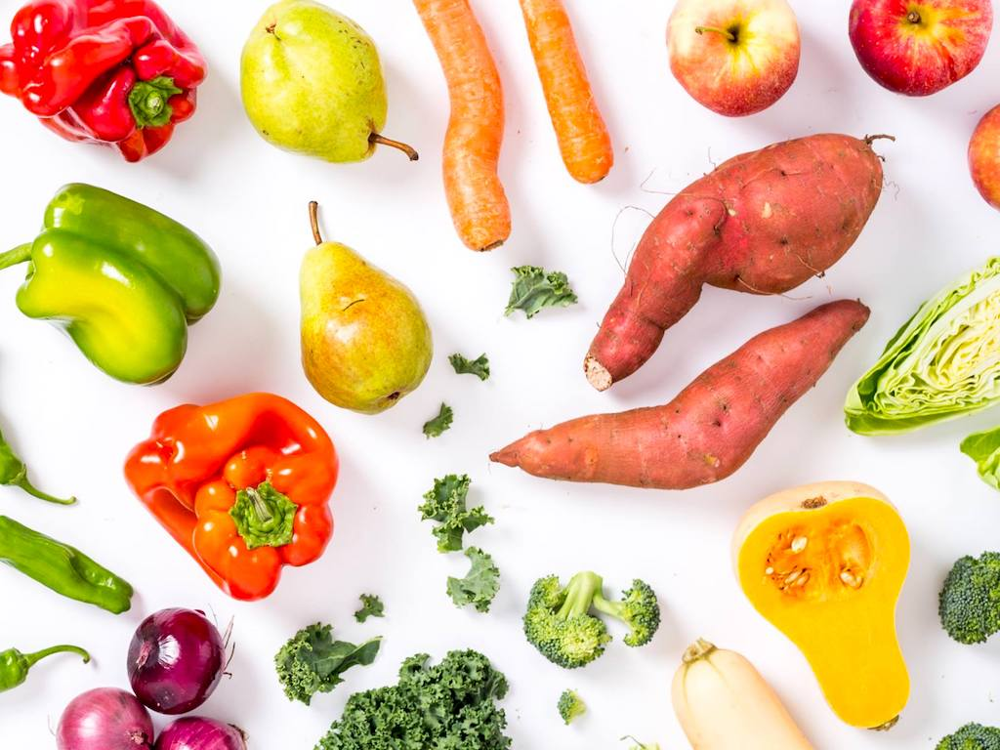

# Welcome to Funky Food!

Funky Food is where flavor meets innovation to dance in a symphony of the extraordinary. We're on a mission to revolutionize the way you think about and consume food. Our GitHub organization is the hub for all our digital projects, from our apps to the backend solutions that get fresh food to your door every week.

## Our Mission
At Funky Food, we believe in pushing the boundaries of culinary arts and technology. Our mission is to create cutting-edge tools and platforms that enhance the food experience for chefs, home cooks, and food lovers worldwide.

## What We Do

### Innovative Culinary Tools:
Developing software that assists in creating and sharing revolutionary recipes.

### Sustainable Food Supply Chain Solutions:
Harnessing technology to promote sustainability within the food industry.

### Community Engagement Platforms:
Building interactive forums and apps that connect food enthusiasts around the globe.

